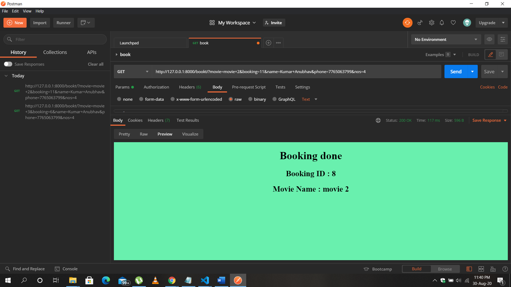

# Django-MOVIE-Ticket-booking:
Django based web app which implements ticket booking for multiple movies, update ticket and auto delete tickets after fixed time.

## Working Screenshots POSTMAN:

## HOME PAGE of our website:

## Installation Pre-requisites:

django
djangorestframework
psycopg2

To install following dependencies Use:
sudo pip install -r requirements.txt

Usage:
Clone the repo
git clone https://github.com/kumaranubhav1654/Django-MOVIE-Ticket-booking

Install Pre-Requisites:
sudo pip install -r requirements.txt

Change to /project directory
cd project
Run this command
python manage.py runserver
Open a browser and go to 127.0.0.1:8000

Important Notes:
Always ensure that DB has appropriate entries before you try to book tickets. Case in point,
 make sure you have added Seats for a show for the movie Today (system time). If not, go to: 127.0.0.1:8000/admin to add the seats and try again.

Author:
kumaranubhav1654 - Django-MOVIE-Ticket-booking - kumaranubhav1654
License:
This project is licensed under MIT License - see the LICENSE.md file for details.
